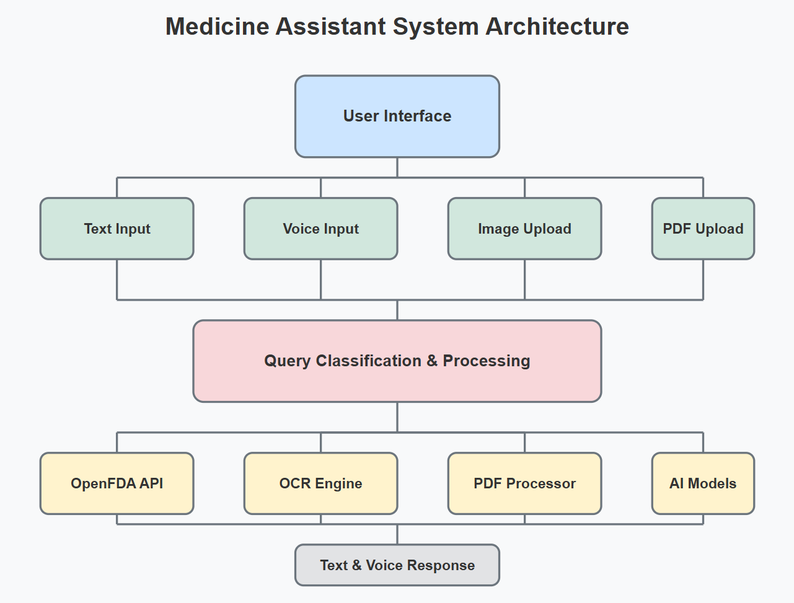

# Smart Medicine Assistant 💊
An intelligent, multi-functional healthcare platform designed to simplify medication management and provide accessible health information, especially for seniors, caregivers,visually impaired, and individuals with chronic conditions.

---

## 🎯 Project Goals
The Smart Medicine Assistant aims to:

- Simplify medication management for users, particularly seniors and those with chronic conditions.
- Provide reliable health information through an accessible, conversational interface.
- Reduce medication errors with image recognition.
- Improve document comprehension by enabling natural language interaction with medical documents.
- Create an intuitive healthcare companion that integrates multiple tools in one unified interface.
  
---

## 🚀 Features

- 🔎 **Drug Lookup**: Fetches detailed medicine information using the [OpenFDA API](https://open.fda.gov/apis/) and OpenAI-powered name extraction.
- 📄 **PDF QA**: Upload medical documents and ask questions about their content via a LangChain QA system.
- 🧠 **Smart Query Classification**: Distinguishes between drug inquiries, symptoms, greetings, and more using GPT-based classifiers.
- 🎤 **Voice Chat**: Interact hands-free via OpenAI Whisper speech recognition and text-to-speech feedback.
- 📷 **OCR on Labels**: Upload medicine label images to extract and understand drug names using EasyOCR.

---

## 🏗️ System Architecture



**Components:**
- **Streamlit UI**: Web interface for user interaction.
- **LangChain Agent**: Intelligent agent using GPT for decision-making.
- **PDF QA Chain**: Extracts text from PDFs and answers questions using vector search.
- **Speech Module**: Whisper API for input, gTTS + Pygame for output.
- **OCR Module**: Uses EasyOCR to extract text from uploaded images.

---

## ⚙️ Methodology

### Query Handling
- GPT classifies queries and extracts drug names.
- LangChain’s ReAct agent routes questions to the appropriate tool.

### PDF Document QA
- PDFs are chunked and embedded using OpenAI’s Embeddings.
- FAISS is used for vector storage and retrieval.
- LangChain's RetrievalQA answers document-specific questions.

### Voice Input
- Speech is recorded and transcribed using Whisper.
- Responses are converted to audio using gTTS and played with Pygame.

### Image Input
- Images are processed with EasyOCR to extract drug names.
- Extracted names are queried in OpenFDA.
  
### Testing Framework
- Component Testing: Individual validation of each feature module
- Integration Testing: Ensuring seamless interaction between components
- User Experience Testing: Optimizing for ease of use and clarity
- Error Handling: Comprehensive error management for robustness
  
---

## 🚀 Setup Instructions

### 🔧 Prerequisites
- Python 3.8+
- OpenAI API Key
- Internet connection (for OpenAI & FDA API access)

### Dependencies
All dependencies are listed in `requirements.txt`.

### 📥 Installation Steps

1. **Clone the Repository**

```bash
git clone https://github.com/yourusername/smart-medicine-assistant.git
cd smart-medicine-assistant
```
2. **Create and Activate a Virtual Environment**
```bash
python -m venv venv
source venv/bin/activate  # On Windows: venv\Scripts\activate
```
3. **Install Dependencies**
```bash
pip install -r requirements.txt
```
4. **Set Up Environment Variables**
```bash
#Create a .env file in the project root:
OPENAI_API_KEY=your_openai_api_key_here
```
5. **Run the Application**
```bash
streamlit run app.py
```

---

## 📖 Usage Guide

### ▶️ Run the App

```bash
streamlit run app.py
```
### ✨How to Use It:

#### 📸 OCR Medicine Image Example
- Upload an image of a medicine label from the sidebar.
- Click **"Extract Medicine Name"**.
- The assistant will fetch and read relevant info aloud.

#### 📄 Upload PDF Medical Documents
- Upload a medical PDF (e.g., instructions, reports).
- Click **"Process Document"**.
- Ask context-aware questions about it.

#### 🗣️ Voice Mode
- Enable **"Start Voice Chat"** in the sidebar.
- Speak freely and say **"bye"** to stop.

#### 💬 Text Chat
- Type in any query related to medicine, symptoms, or documents.

---

## 📊 Evaluation Results

The evaluation process measures the performance of the system on both **medicine-related queries** and **PDF document-related queries** using **cosine similarity**, **precision**, and **recall**.

After running the evaluation on a sample, we observe the following results:

```bash
=== RESULTS ===
Average Cosine Similarity: 0.839
Precision: 1.0
Recall: 1.0
```

## 🔍 Tracing with LangSmith

To gain deeper insights and debug model behavior, we integrated **[LangSmith](https://smith.langchain.com/)** for tracing and evaluation. This enabled:

- ✅ Step-by-step tracking of query flows  
- 🔍 Visibility into LLM responses, retrieval actions, and cost  
- 🧠 Filtering and monitoring specific query types (e.g., `medicine`, `PDF`, `greeting`)  
- ⚙️ Performance review across different agents such as `AgentExecutor` and `RetrievalQA`

### 📌 Sample Observations

- Queries like **"What is the side effect of Advil?"** were accurately categorized and answered with **high cosine similarity**.
- **Deep tracing** helped identify and resolve confusion where the model wasn't sure whether to answer from **PDF content** or **OpenFDA data**.

> 📈 **Outcome**: This tracing strategy significantly enhanced the **reliability**, **interpretability**, and **debugging efficiency** of the assistant.
> 
---

## 📁 Repository Structure
```plaintext
AI-Medicine-Assistant/
│
├── app.py                   # Main Streamlit application for UI and logic
├── Medical_chatbot.ipynb    # Notebook for prototyping and testing
├── Experiments.ipynb        # Complete experimentation notebook
├── requirements.txt         # Python package dependencies
├── Presentation_MedicineAssistant.pdf  # Presentation of the project
├── Experiments.ipynb        # Experiments of the project
├── .env                     # Environment variables (e.g., OpenAI API key)
├── .gitignore               # Files and folders to ignore in Git
├── README.md                # Project overview and documentation
└── assets/
    └── system_architecture.png  # Visual diagram of system architecture
